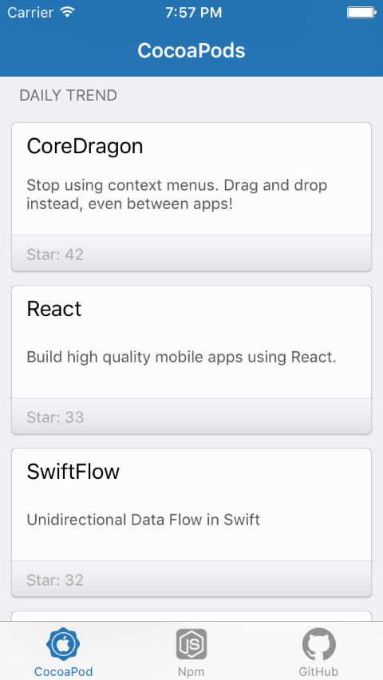
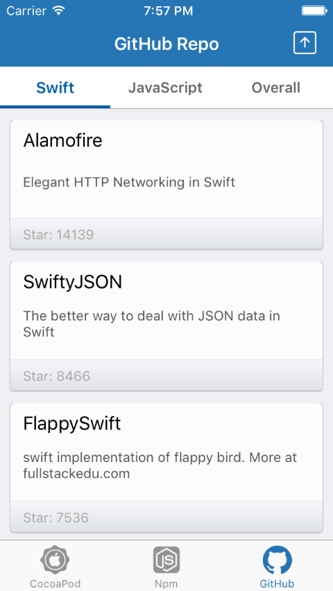
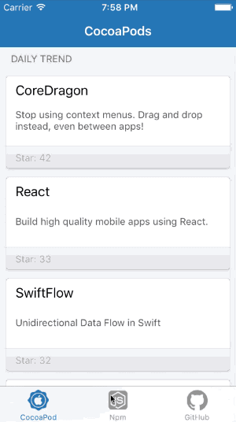

## iOS DevAPI Trend

> Discover and explore the trend of hot Development APIs on CocoaPod, NPM.js, and Github.

 &nbsp; &nbsp; &nbsp;
 &nbsp; &nbsp; &nbsp;

### Goals / API Used: 
- [Alamofire](https://github.com/Alamofire/Alamofire): Elegant HTTP Networking in Swift
- [SwiftyJSON](https://github.com/SwiftyJSON/SwiftyJSON): The better way to deal with JSON data in Swift
- [Kanna](https://github.com/tid-kijyun/Kanna): Kanna is an awesome XML/HTML parser for MacOSX/iOS.
- [MJRefresh](https://github.com/CoderMJLee/MJRefresh): An easy way to use pull-to-refresh.
- Data Sources: [Trending CococaPods](https://trendingcocoapods.github.io), [Npm.js Star](https://www.npmjs.com/browse/star), [GitHub API](github api search repositories)

---

### To-Dos List:
- Implement Better UITableViewCell design with: [MaterialCardView](https://github.com/cemolcay/MaterialCardView)
- Enhance AutoLayout with [SnapKit](http://snapkit.io)
- Local file cache management and optimazation 

---

### Installation:
- Make sure you have [Carthage](https://github.com/Carthage/Carthage) installed: brew install carthage 
- Run Carthage command: carthage update --platform ios
- Good to go, open the xcode project file.